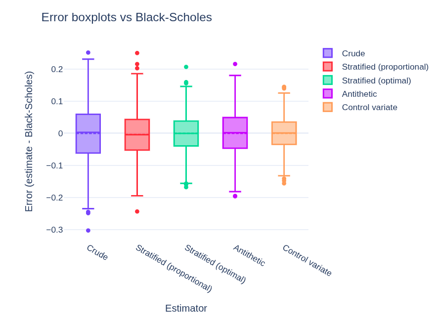
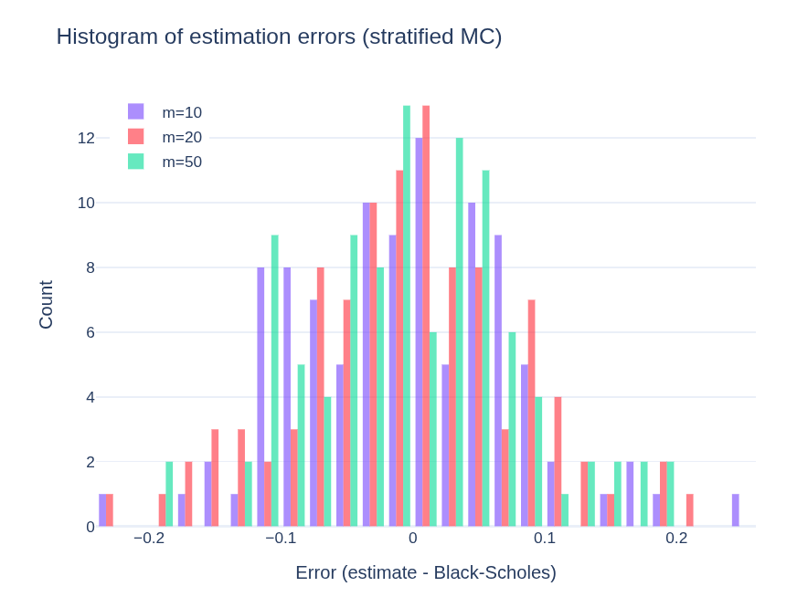

# 📈 Monte Carlo Pricing of Barrier Options  
### *Up-and-Out Call • Variance Reduction • Statistical Rigor*
by **Mikołaj Płóciniczak** [[LinkedIn]](https://www.linkedin.com/in/miko%C5%82aj-plociniczak/)



> “It’s not just about computing — it’s about computing **better**.”

---

## 🎯 Project Goal

This project implements pricing of an exotic **up-and-out call option** using Monte Carlo simulation and systematically compares the quality of different estimators.

This is not just another pricing script — it is a **statistical laboratory**, where we evaluate:

- 📉 **bias**
- 📊 **MSE (mean squared error)**
- 🎯 **coverage (confidence interval accuracy)**
- ⚡ **variance reduction factor (VRF)**

---

## 🧠 Why it matters

In real-world financial applications (e.g. risk modeling or pricing in institutions):

- computational budget is limited  
- estimators must be **stable and reliable**  
- decisions rely on **statistically sound outputs**

This project focuses not only on *how to compute*, but on *how to compute efficiently and robustly*.

---

## 🏗️ Project Structure
```
├── models/ # stochastic process simulation
├── payoffs/ # option payoff definitions
├── methods/ # Monte Carlo estimators
├── scripts/ # experimental pipeline
├── data/ # stored results (pickle)
├── plots/ # visualization data
├── notebooks/ # report / analytical write-up
```

---

## ⚙️ What happens under the hood?



### 1. 🔄 GBM Path Simulation
- `models/simulate_gbm_paths.py`
- accelerated with **Numba**
- efficient simulation of geometric Brownian motion trajectories

---

### 2. 🚧 Barrier Payoff Evaluation
- `payoffs/payoff_up_and_out_call.py`
- option is knocked out if the barrier is breached

---

### 3. 🧮 Monte Carlo Estimators (`methods/`)

Implemented approaches:

| Method              | Idea |
|---------------------|------|
| `crude`             | standard Monte Carlo |
| `stratified`        | improved sampling coverage |
| └─ Neyman allocation | variance-optimal allocation |
| `antithetic`        | variance reduction via symmetry |
| `control variate`   | leveraging known correlations |

---

### 4. 🧪 Experimental Pipeline (`scripts/`)

Scripts:

- 🔁 generate **multiple estimator replications**
- 📊 compute:
  - bias
  - MSE
  - coverage
- ⚖️ build **VRF (variance reduction factor) tables**
- 📉 produce:
  - histograms
  - boxplots
- 🎯 compute reference value `I_ref` via large-scale crude MC (chunked)

---

## 📦 Outputs

Stored as:

- `data/*.pkl` → experimental data  
- `plots/*.pkl` → visualization-ready data  

The setup supports:
- reproducibility  
- offline analysis  
- extensibility  

---

## 📊 Nature of the Project

This is not just an implementation — it is a:

- 🧠 **statistical experiment**
- ⚙️ **methodological benchmark**
- 📈 **estimator quality analysis**
- 📚 **structured analytical report** (see `notebooks/`)

---

## 💡 What makes this project stand out?

- ✅ focus on **estimation quality**, not just results  
- ✅ consistent comparison across methods  
- ✅ aligned with **quantitative finance practices**  
- ✅ clear separation of concerns:
  - model  
  - payoff  
  - estimator  
  - experiment  

---

## 🧑‍💼 Target Applications

Relevant for:

- quantitative finance  
- risk modeling  
- exotic option pricing  
- Monte Carlo analysis  

---

## 🚀 How to run

```bash
pip install -r requirements.txt
python scripts/<selected_script>.py
```

*(scripts are modular and self-documented in code)*

---

## 🧾 Summary

This project addresses a key question:

>How can we obtain better estimators under the same computational budget?

And answers it in a way that is:

- systematic
- measurable
- reproducible

---

## 🤝 Contact

If you're interested in:

- Monte Carlo methods
- variance reduction techniques
- quantitative finance

→ feel free to reach out.